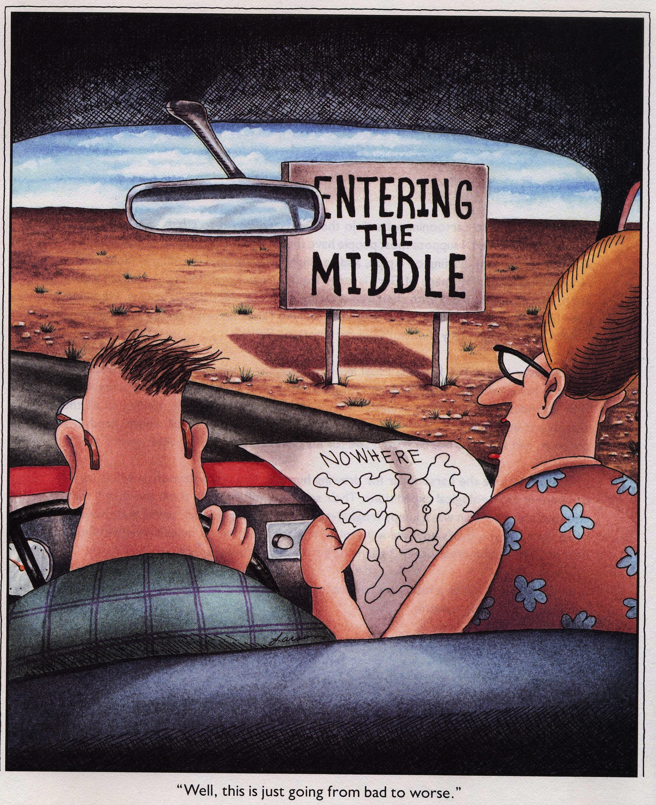

  

# Spatial Mapping in *R*

*Site Updated: `r format(Sys.Date())`*

 

## Maps

Computer literacy is now essential in all aspects of science. Data management skills are needed for entering data without errors, storing it in a usable way, and extracting key aspects of the data for analysis. **Maps are no different**. We want to know how to provide spatial information in a clear and concise way so any reader can extract the important bits. Communicating the details visually is sometimes a difficult task, made more complicated by the influx of tools and methods available. 

## Goals

The good news (and bad news) is there are many tools & packages available to use for spatial analysis and mapping in R. It is probably impossible to introduce everything, but the goal of this tutorial is to show a few different ways to get spatial data into R, and visualize it. In addition, the [*Resources*](resources.html) tab provides links to a smattering of tutorials, background info, vignettes, etc. Check it out!

