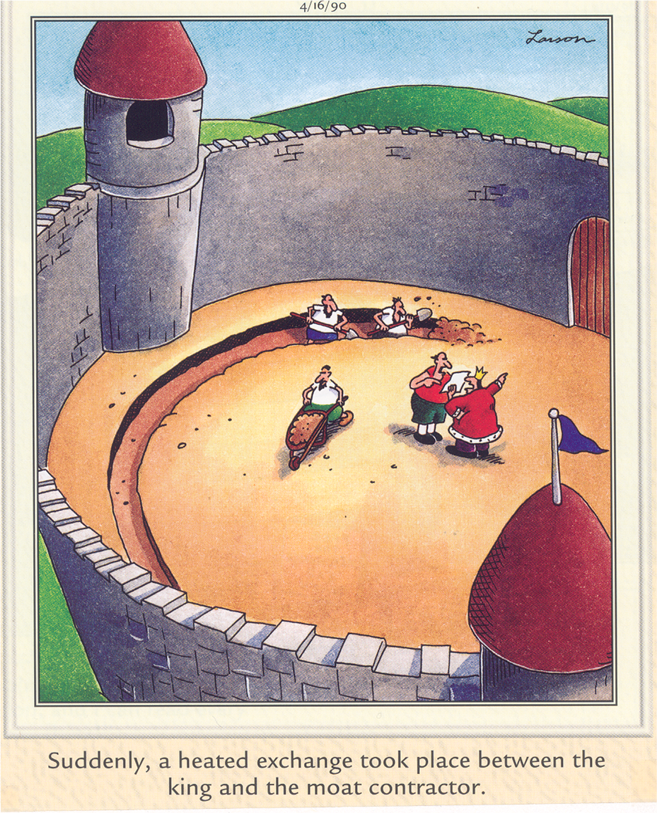

 

## All Maps are Not Created Equally

 

**_Good maps make a difference!_**

 

While there many ways to make a map, ultimately it would seem there should only be one way to interpret a map. A map cut through confusion and clarify where things are in space (or time). If a map is effective, a reader shouldn't need too much time to observe the information the map is trying to portray. 

Maps can be very effective **and** beautiful! They do not need to be one or the other. Good visualizations often simplify to the pieces (landscapes, points of interest, temporal change) of interest, and remove any other distractions. 

### Keep Things Simple!

Maps don't need to have every single layer or detail. They need **the relevant details**, so anyone can quickly take a look at the map, orient themselves, and extract the important information.

This animation (created by Darkhorse Analytics, and used in Jenny Bryan's excellent [stat545](http://stat545.com/block015_graph-dos-donts.html) course) shows how *simplification* can make a big difference in communication. Granted, this is for figures, and not specifically for maps, but the point is the same.

## Projections and Coordinate Reference Systems (CRS)

If you aren’t sure what the difference between projected (PCS) and geographic coordinate systems (GCS) are, here’s a (*very simplified*) summary. A few very helpful websites are:

 - http://epsg.io/
 - http://spatialreference.org

### GCS (Geographic Coordinate System)

**GCS** are based on spherical earth models (3-dimensional), and therefore use spherical coordinate systems (e.g., latitude and longitude), or `datum`, in a 3-dimensional space to define locations based on a `spheroid`/`ellipsoid` model (of which there are many). The `datum` is used to link the spheroid model to the earth’s surface. Calculating distances along this model utilizes geodesic or Great Circles. A few common GCS:

 - **NAD83 [4269]**: `ellipsoid` = *GRS 1980*, `datum` = *North American Datum 1983*, `unit` = *Degree*, `prime meridian` = `Greenwich`)
 - **NAD27 [4267]**: `ellipsoid` = *Clarke 1866*, `datum` = *North American Datum 1927*, `unit` = *Degree*, `prime meridian` = `Greenwich`)

### PCS (Projected Coordinate Systems)

PCS project locations onto a 2-dimensional Cartesian coordinate plane. That’s why we refer to these as **map** projections, because they help flatten the 3d spheroid onto a flat plane, which is good for displaying maps. Different projections have different ways of stretching the 3-d earth’s surface onto a flat 2-d plane. By putting things onto a flat 2-d surface, calculations and analysis can be calculated on a *grid*, versus with geodesic (Great Circles). It's possible to do great circle calculations with a PCS, these are sometimes referred to as `geodetic` calculations. So, these are basically GCS **projected** onto a flat surface...so they have the GCS components, plus a "projection" component. Some common PCS:

 - **WGS84 [4326]**: `ellipsoid` = *WGS 1984*, `datum` = *World Geodetic System 1984*, `unit` = *Degree*, `prime meridian` = `Greenwich`)
 -  **NAD83/Albers [EPSG: 3310]**: `geodetic CRS`= *NAD83(NSRS2007)*, `ellipsoid` = *GRS 1980*, `datum` = *North American Datum 1983 (National Spatial Reference System 2007)*, `unit` = *meter*, `prime meridian` = `Greenwich`)
 - **NAD83(NSRS2007/UTM Zone 10N) [EPSG: 3717]**: `geodetic CRS`= *NAD83*, `ellipsoid` = *GRS 1980*, `datum` = *North American Datum 1983*, `unit` = *meter*, `prime meridian` = `Greenwich`)
  - **NAD83(2011)/Conus Albers [EPSG: 6350]**: `geodetic CRS`= *NAD83(2011)*, `ellipsoid` = *GRS 1980*, `datum` = *North American Datum 1983*, `unit` = *meter*, `prime meridian` = `Greenwich`)
  - **NAD83/California Zone 4 (ftUS) [EPSG: 2228]**: `geodetic CRS`= *NAD83*, `ellipsoid` = *GRS 1980*, `datum` = *North American Datum 1983*, `unit` = *US survey foot*, `prime meridian` = `Greenwich`)

Overwhelmed? It's okay...one step at a time!

