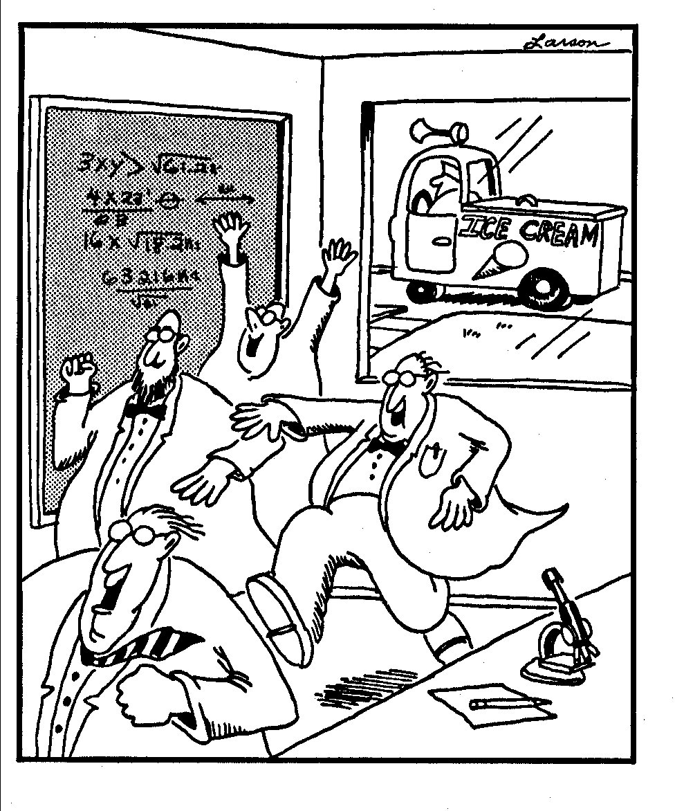

 

# Working with `rasters`

The main package that gets used for working with **raster** data (and for many other functions) is the `raster` package. For more comprehensive tutorials, I recommend the [NEON data skills tutorial](http://neondataskills.org/R/Raster-Data-In-R/). 

Recently we just had a tutorial on using **rasters** at our Davis R-Users Group. Check it out [here](http://d-rug.github.io/blog/2017/Kate-Tiedeman-on-using-the-raster-package).

There are many other resources available for working with rasters. Future posts/tutorials may include working with `sf` and rasters, but for now the `raster` package is (and should be) the default.

And now I distract the sparse content on this page with this Farside comic:

